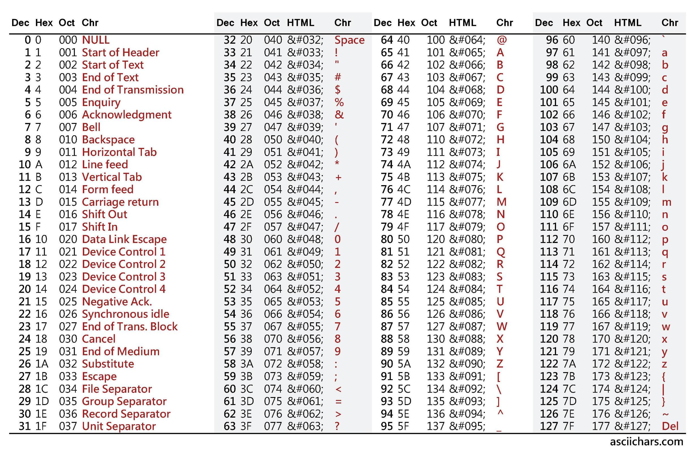

# Projet de Téléinfo sur ESP32 en microPython

Le but de ce projet est de porter un [code Python que j'utilisais](RPi/teleinfo.py) sur un RPi vers un ESP32 en gardant la possibilité de l'OTA via ESPHome

## Recherches

J'ai ouvert une discussion sur le sujet sur le forum [HACF](https://forum.hacf.fr/t/esp32-et-micropython/1447)

### microPython et ESP32

### Téléinfo

Le descriptif suivant est fait pour un mode ***historique*** du compteur Linky, pour un autre mode il faut se reporter à la documentation officiel [ENEDIS](https://www.enedis.fr/sites/default/files/Enedis-NOI-CPT_54E.pdf).

Les trames envoyées par un compteur Linky en mode historique sont définies dans la documentation officielle [ENEDIS](https://www.enedis.fr/sites/default/files/Enedis-NOI-CPT_54E.pdf) à la page 9/38 § *5.3.Caractéristiques des informations de TIC en mode standard*.

exemple de trame Téléinfo :

```log
<STX>
...
ADCO<SP>123456789012<SP>P<CR>
OPTARIF<SP>BASE<SP>0<CR>
ISOUSC<SP>30<SP>9<CR>
BASE<SP>002565285<SP>,<CR>
PTEC<SP>TH..<SP>$<CR>
IINST<SP>002<SP>Y<CR>
IMAX<SP>030<SP>B<CR>
PAPP<SP>00420<SP>'<CR>
MOTDETAT<SP>000000<SP>B<CR>
...
<ETX>
```

Une trame commence donc par un caratères `STX` (Start of Text) et finie toujours par un caractère `ETX` (End of Text), chaque groupe d'informations dans la trame est séparée par un caractère `CR` (Carriage Return).

Une trame comprend donc plusieurs groupes d'informations. Ces groupes d'informations sont composés d'une `étiquette`, d'une `donnée` et d'un `checksum` séparé par un caractère `SP` (Space).

<table>
  <th>
    <td colspan=7>Format d'un groupe d’information du mode historique
  <tr>
    <td colspan=1>< LF ><br>(0x0A)
    <td colspan=1>Etiquette
    <td colspan=1>< SP ><br>(0x20)
    <td colspan=1>Donnée
    <td colspan=1>< SP ><br>(0x20)
    <td colspan=1>Checksum
    <td colspan=1>< CR ><br>(0xOD)
  <tr>
    <td>
    <td colspan=3 style="background: #DCDCDC;">Zone contrôlée par un checksum
    <td colspan=3>
</table>

Le dernier caractère permet de valider les données qui précèdent. C'est ce que l'on appelle un *Checksum*.

Le checksum est calculée sur l'ensemble des caractères allant du début du champ `Etiquette` à la fin du champ `Donnée`, caractères < SP > inclus.
Le principe de calcul du Checksum est le suivant :

- calcul de la somme « S1 » de tous les caractères allant du début du champ `Etiquette` jusqu’au délimiteur (non inclus) entre les champs `Donnée` et `Checksum`) ;
- cette somme déduite est tronquée sur 6 bits (cette opération est faite à l’aide d’un ET logique avec 0x3F) ;
- pour obtenir le résultat checksum, on additionne le résultat précédent S2 à 0x20.

En résumé :
> Checksum = (S1 & 0x3F) + 0x20

Le résultat sera toujours un caractère ASCII imprimable compris entre 0x20 et 0x5F

Tableau des caractères ASCII et leur code Décimal, Héxa, Octal :


## le code Python

### Lecture de la trame

Le principe de lecture de la trame est le suivant :

- On "écoute" le port jusqu'à lire un caractère `LF`
- On sauvegarde ce qui passe juste après le caractère `LF` jusqu'au caractère `CR` non inclus
- on retourne cette trame.

Ce processus est implémenter par la function `lectureTrame()` dan sle fichier [teleinfo.py](RPi/teleinfo.py).

La "compréhension" de cette trame sera déléguée au [décodage de la trame](#decodage-de-la-trame).

### decodage de la trame

Le décodage de la trame permet de séparer la trame en groupe d'informations.
Il suffit de couper cette trame à chaque fois qu'un caractère `CR` est trouvé dans la trame.

Ensuite pour chaque groupe d'information, il suffira de valider la cohérence des informations.

### Validation des données

La validation du groupe d'information permet, via le calcul du checksum, d'être sûr que la donnée reçue est conforme.

Si la donnée reçu n'est pas conforme, elle ne sera pas publiée.

Pour chaque groupe d'information, on calcule son checksum que l'on va comparer au checksum reçu (le dernier caractère du groupe d'information).

### Calcul de la cohérence

Le calcul du checksum en décimal s'effectue de la façon suivante :

- Pour chaque caractère de la chaine à vérifier, on récupère la valeur décimale de ce caractère
- On incrémente de cette valeur une somme sum
- Une fois "calculé" tous les caractères, cette sum est tronquée sur 6 bits (cette opération est faite à l’aide d’un ET logique avec 63)
- Puis on ajoute 32 à sum
- Le caractère de checksum s'obtient en récupérant le caractère ASCII correspondant à la valeur décimale sum

exemple pour ce groupe d'information :

```log
IMAX<SP>030<SP>B<CR>
```

| caractère | valeur déc du caractère | somme incrémentée |
| :-------: | :---------------------: | :---------------: |
|   I       | 'I' <=> 73              |        73         |
|   M       | 'M' <=> 77              |        150        |
|   A       | 'A' <=> 65              |        215        |
|   X       | 'X' <=> 88              |        303        |
| < SP >    | '<SP>' <=> 32           |        335        |
|   0       | '0' <=> 48              |        383        |
|   3       | '3' <=> 51              |        434        |
|   0       | '0' <=> 48              |        482        |

On tronque la somme sur 6 bits :
> 482 & 63 = 34

On ajoute 32 :
> 34 + 32 = 66

Dans le tableau ASCII, la valeur décimale correspondant à `66` correspond à un `B`
